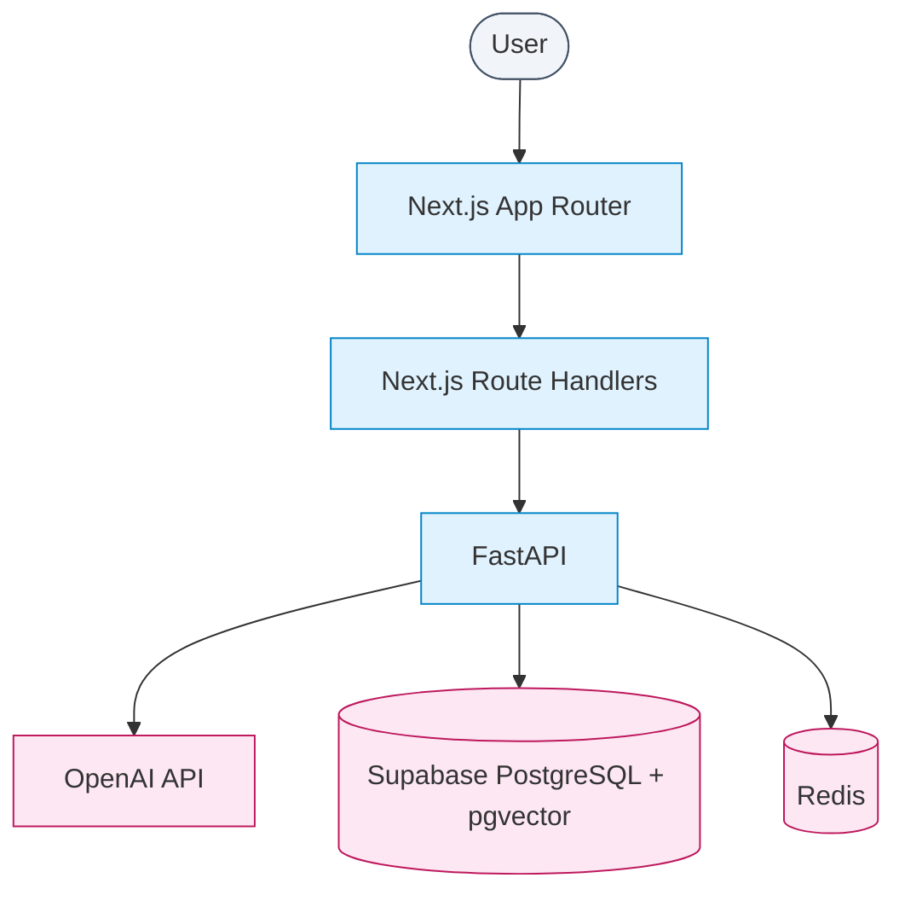
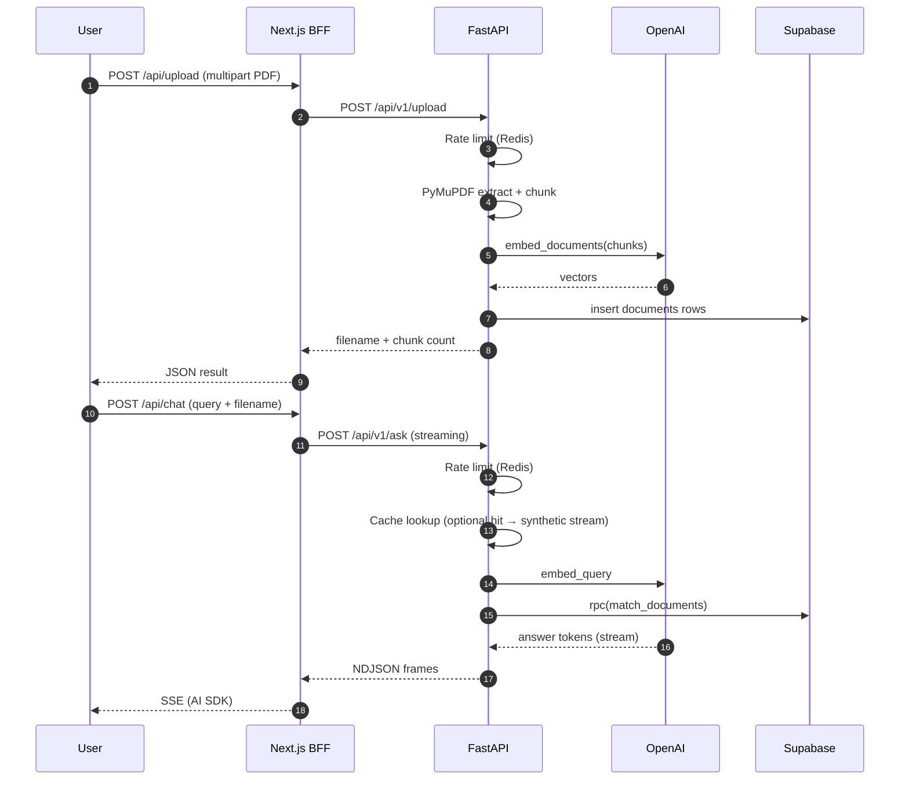

# Vector Vault AI

[](https://www.python.org/)
[](https://nextjs.org/)
[](https://fastapi.tiangolo.com/)
[](https://supabase.com/)

> Upload a PDF, embed chunks into **Supabase pgvector**, and chat with your document through a **streaming RAG** pipeline — Next.js UI, FastAPI core, Redis-backed rate limits and response cache.

## Demo

### Live UI

**Production:** [vector-vault-ai.vercel.app](https://vector-vault-ai.vercel.app/)

Typical flow:

1. Upload a **PDF** (required before chat — only `application/pdf` is accepted).
2. Ask questions; answers stream token-by-token and cite source fragments.
3. Use the inline PDF viewer and source badges to jump to the quoted passage.

### Screen capture


### API — Redis-backed rate limiting

Bursty traffic on expensive routes is capped with a **Lua script** in Redis (`INCR` + `EXPIRE` TTL window): **per client IP** (honours `X-Forwarded-For` when present). Horizontal scaling requires a **shared** Redis URL — in-memory limits would diverge per replica.

| Route | Ceiling |
| --- | --- |
| `POST /api/v1/upload` | 5 / minute |
| `POST /api/v1/ask` | 20 / minute |

Exceeded limits → **429** with a human-readable retry hint. Implementation: `backend/app/core/rate_limit.py`.

---

## Table of contents

1. [Demo](#demo)
2. [Why this exists](#why-this-exists)
3. [Architecture](#architecture)
4. [Pipeline — upload then chat](#pipeline--upload-then-chat)
5. [Operations & debugging](#operations--debugging)
6. [Quick start](#quick-start)
7. [Configuration](#configuration)
8. [Step-by-step setup](#step-by-step-setup)
9. [Local verification](#local-verification)
10. [Project structure](#project-structure)
11. [Architectural invariants](#architectural-invariants)

---

## Why this exists

Teams accumulate knowledge in long PDFs — manuals, specs, policies. Keyword search breaks on paraphrases; generic chatbots hallucinate without grounding.

**Vector Vault AI closes the loop:**

| Stage | What it does |
| --- | --- |
| **Ingest** | PDF bytes → text via **PyMuPDF** (native text layer — not a separate OCR pipeline). |
| **Chunk** | `RecursiveCharacterTextSplitter` (LangChain) — configurable overlap for context continuity. |
| **Embed** | OpenAI **`text-embedding-3-small`** → 1536-d vectors. |
| **Store** | Rows in Supabase `documents` (`content`, `embedding`, JSON `metadata` with `filename` + `chunk_index`). |
| **Retrieve** | RPC **`match_documents`** — cosine distance via pgvector **HNSW**, optional `filter_filename` for single-document sessions. |
| **Answer** | **`gpt-4o-mini`** streams tokens; prompt constrains answers to retrieved context (plus formatting rules for math / language). |

Cached **exact** question repeats (same normalized query, filename scope, `top_k`, `include_full_content`) skip the LLM for ~10 minutes — see `backend/app/core/cache.py`.

---

## Architecture



**What each box does:**

| Box | Role | Code |
| --- | --- | --- |
| Next.js UI | PDF upload UX, chat (`useChat` + AI SDK), pdf.js viewer | `frontend/app/` |
| Route handlers | Proxy uploads + transform backend stream → **SSE** for the AI SDK | `frontend/app/api/upload/route.ts`, `frontend/app/api/chat/route.ts` |
| FastAPI | REST + streaming RAG | `backend/main.py`, `backend/app/` |
| OpenAI | Embeddings + chat completions | `backend/app/core/clients.py` |
| Supabase | Vector storage + `match_documents` RPC | SQL in [`backend/README.md`](./backend/README.md) |
| Redis | Rate limits + chat response cache | `backend/app/core/rate_limit.py`, `backend/app/core/cache.py` |

### Tech stack

| Layer | Choice | Rationale |
| --- | --- | --- |
| **Frontend** | Next.js 16 · React 19 · Tailwind v4 · Vercel AI SDK (`ai`, `@ai-sdk/react`) | Streaming chat with minimal glue; App Router API routes hide backend URL from the browser when desired. |
| **Backend** | FastAPI · Pydantic v2 · Uvicorn | Async-friendly streaming, automatic OpenAPI at `/docs`. |
| **PDF** | PyMuPDF | Fast text extraction from PDF streams — no extra OCR service in this repo. |
| **Chunking / LLM** | LangChain text splitters · LangChain OpenAI wrappers | Thin abstraction over OpenAI; shared client singletons. |
| **Vectors** | Supabase + pgvector + HNSW index | Managed Postgres, RPC for parameterized similarity search. |
| **Cache / limits** | Redis (async client) | Cross-request rate limiting and deterministic cache keys (SHA-256 over query dimensions). |
| **Deploy** | Vercel (frontend) · Cloud Run–friendly container (backend) | Stateless API + external Redis/Supabase — see `backend/Dockerfile`. |

### Architectural highlights

- **BFF boundary.** The browser talks to `/api/upload` and `/api/chat`; those handlers forward to `API_BASE_URL` — keeps OpenAI and Supabase keys off the client.
- **Two wire formats.** FastAPI emits **newline-delimited** frames (`0:` text chunk, `2:` sources payload, `3:` error); the Next handler transcodes to **SSE** for `useChat`. See `frontend/app/api/chat/route.ts`.
- **`/health` is shallow.** It does not ping Redis, OpenAI, or Supabase — a passing health check does **not** prove uploads or chat will work.
- **Filename-scoped RAG.** Upload returns the stored filename; chat passes `filename` so retrieval hits only that document’s chunks.

---

## Pipeline — upload then chat



**Failure semantics (high level):**

- **400** — Validation (`ValueError` from empty PDF text, non-PDF upload, bad chat payload).
- **429** — Redis rate limit exceeded.
- **500** — Uncaught exceptions (missing env, Redis unreachable, Supabase/OpenAI errors). Upload handler only translates `ValueError` to 400; dependency failures surface as 500.

---

## Operations & debugging

### Health vs. readiness

| Endpoint | Proves |
| --- | --- |
| `GET /health` | Process is up (`{"status":"ok"}`). |
| `GET /docs` | FastAPI schema generation works. |
| `POST /api/v1/upload` | Redis + OpenAI + Supabase + PDF path end-to-end. |

Startup logs a **warning** if Redis ping fails during lifespan — the app still boots, but **`/upload` and `/ask` will error** when Redis is required by dependencies.

### Production checklist

1. Set **`REDIS_URL`** to a reachable instance (not `localhost` on Cloud Run).
2. Confirm **`OPENAI_API_KEY`**, **`SUPABASE_URL`**, **`SUPABASE_SERVICE_KEY`** on the API service.
3. Run the SQL from [`backend/README.md`](./backend/README.md) so `documents` + **`match_documents`** exist.
4. Align **`CORS_ORIGINS`** with your frontend origin(s) — default targets Vercel production.

---

## Quick start

**Backend + Redis (Docker Compose):**

```bash
git clone https://github.com/KVM1L03/vector-vault-ai.git
cd vector-vault-ai/backend
# Create .env — see Configuration
docker compose -f compose.yaml up --build
```

API: http://localhost:8000 · Docs: http://localhost:8000/docs

**Frontend (second terminal):**

```bash
cd ../frontend
npm install
echo 'API_BASE_URL=http://localhost:8000' > .env.local
npm run dev
```

App: http://localhost:3000

---

## Configuration

### Backend (`backend/.env`)

| Variable | Required | Description |
| --- | --- | --- |
| `OPENAI_API_KEY` | yes | OpenAI credentials for embeddings + chat. |
| `SUPABASE_URL` | yes | Supabase project URL. |
| `SUPABASE_SERVICE_KEY` | yes | Service role key (server-side only). |
| `REDIS_URL` | strongly recommended | Defaults to `redis://localhost:6379/0` — **wrong** for remote/container hosts without local Redis. |
| `CORS_ORIGINS` | no | Comma-separated allowed origins (default: `https://vector-vault-ai.vercel.app`). |
| `PORT` | no | Listen port (Cloud Run injects this; local `main.py` defaults to 8000). |

`compose.yaml` may pass additional variables for future use — the runtime clients in `backend/app/core/clients.py` only consume the keys above for AI + Supabase + Redis.

### Frontend (`frontend/.env` or `.env.local`)

| Variable | Description |
| --- | --- |
| `API_BASE_URL` | FastAPI base URL for route handlers (default in code: `http://localhost:8000`). |

Set this in **Vercel** / hosting to your deployed API (e.g. Cloud Run URL).

---

## Step-by-step setup

### 1. Supabase schema

Run the SQL block in **[`backend/README.md`](./backend/README.md)** (extension, `documents` table 1536-d vectors, HNSW index, **`match_documents`** RPC). Without this, inserts and retrieval fail at runtime.

### 2. Redis

- **Docker:** `compose.yaml` brings up `redis_cache` and wires `REDIS_URL` for the `api` service.
- **Cloud:** provision Redis (e.g. managed) and set **`REDIS_URL`** on the API deployment.

### 3. Run services

Follow [Quick start](#quick-start). Confirm `POST /api/v1/upload` with a small PDF before debugging the UI.

---

## Local verification

There is **no** GitHub Actions workflow or pytest suite in this repository today. Before pushing, a minimal manual matrix:

```bash
cd backend && python -m pip install -r requirements.txt
# optional: ruff/mypy if you add them later

cd ../frontend && npm run lint
```

---

## Project structure

```
.
├── backend/
│   ├── main.py                 # FastAPI app, CORS, lifespan (Redis ping), routers
│   ├── Dockerfile              # Cloud Run–oriented image (uvicorn, PORT)
│   ├── compose.yaml            # api + redis_cache for local dev
│   ├── requirements.txt
│   └── app/
│       ├── core/
│       │   ├── clients.py      # OpenAI, Supabase, splitter, Redis singletons
│       │   ├── cache.py        # Chat cache (Redis JSON, TTL)
│       │   └── rate_limit.py   # Redis Lua rate limiter
│       ├── chat/               # POST /api/v1/ask — streaming
│       ├── upload/             # POST /api/v1/upload — PDF → vectors
│       └── services/
│           └── rag.py          # match_documents + prompt + LLM stream
│
├── frontend/
│   ├── app/
│   │   ├── page.tsx            # Chat + PDF viewer page
│   │   └── api/
│   │       ├── chat/route.ts   # BFF: backend stream → SSE
│   │       └── upload/route.ts # BFF: multipart proxy
│   └── package.json
│
└── README.md
```

Deeper backend layout: [`backend/README.md`](./backend/README.md).

---

## Architectural invariants

1. **PDF-only ingest.** Upload rejects non-`.pdf` filenames — enforced server-side.
2. **1536-d embeddings.** Schema and RPC assume **`text-embedding-3-small`**; changing model requires migration.
3. **Service role on the API.** Only the backend uses `SUPABASE_SERVICE_KEY`; never expose it to Next.js client bundles.
4. **Redis is part of the hot path** for rate limiting and optional chat cache — absence manifests as **500** on chat/upload, not as `/health` failure.
5. **Streaming contract.** Backend NDJSON prefixes (`0`, `2`, `3`) must stay aligned with `transformBackendToUIMessageStream` in `frontend/app/api/chat/route.ts`.

---

## Acknowledgements

Layout and documentation tone inspired by **[OmniAccountant](https://github.com/KVM1L03/OmniAccountant)** — adapted here for a smaller RAG surface area (no durable workflow engine, no separate observability stack).
